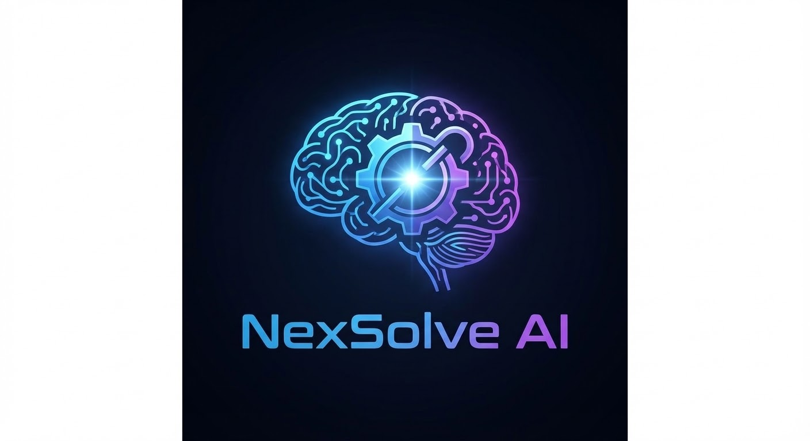

# NexSolve AI

**Bridging Real-World Pain Points with AI-Native Solutions**

[English] | [中文文档](./README.md)

---

## ⚡ Overview

**NexSolve AI** is a decentralized "Pain Point Marketplace" built on GitHub. Traditional industries (catering, retail, logistics) face efficiency bottlenecks, while AI developers seek real-world impact. 

We bridge this gap via GitHub Issues:
- **For Users:** Submit pain points for free; get AI solutions at low/zero cost.
- **For Developers:** Build real-world cases, gain reputation, and negotiate rewards directly.

> **Logic**: Submit Issue -> AI Solving -> Code Delivery -> Private Reward -> Open Source.

---

## 🛠 Workflow

1. **Submit**: Users post structured requirements via the Issue template.
2. **Claim**: Developers reply "I'm working on this" and add the `in-progress` label.
3. **Solve**: Developers use AI tools (Cursor/Claude) to build and reply with the code.
4. **Reward**: Both parties negotiate and settle payments via private channels (WeChat/Alipay/PayPal).
5. **Case**: Successful solutions are featured in our "Hall of Fame".

---
### 🏷️ Label Guide

We use the following labels to track the status of each pain point:

-  : **Original Requirement** (Automatically assigned via template).
-  : **Pending**, waiting for admin review or categorization.
-  : **In Progress**, a developer has claimed this and is building the solution.
-  : **Solved**, the solution has been delivered. Check the Issue for details.
-  : **Bounty Offered**, rewards provided by the requester. High priority for devs.

---

## ⚖️ License (AGPL 3.0)

This project is licensed under **GNU Affero General Public License v3.0**. 

> [!CAUTION]
> If you modify this project or provide network services (SaaS) based on it, you **MUST** open-source your derivative version.

---

## ⚠️ Disclaimer

> [!IMPORTANT]
> **NexSolve AI is a bridge, not a middleman.**

- **Platform Role**: NexSolve AI is an info-sharing platform. We do NOT participate in payments or contract enforcement.
- **Security**: Users MUST review code before execution. We are not liable for any data loss or damages.

---

## 📈 Star History

  <a href="https://star-history.com/#zxz0119/NexSolve-AI&Date">
    <picture>
      <source media="(prefers-color-scheme: dark)" srcset="https://api.star-history.com/svg?repos=zxz0119/NexSolve-AI&type=date&theme=dark" />
      <source media="(prefers-color-scheme: light)" srcset="https://api.star-history.com/svg?repos=zxz0119/NexSolve-AI&type=date" />
      
    </picture>
  </a>

